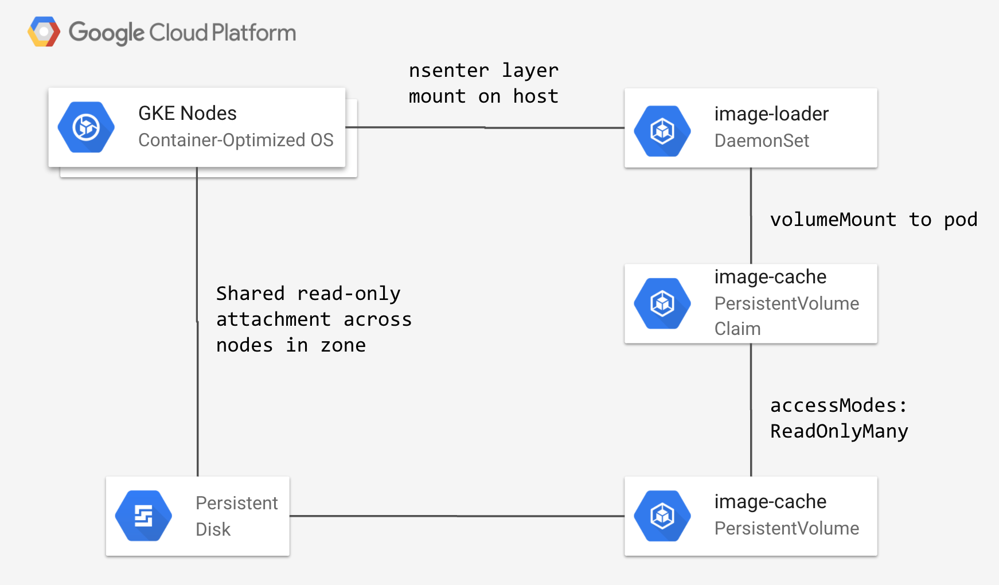

## Selkies node init image cache

## Description

Example showing how to speed up node creation by loading cached images from a read-only persistent disk.

Many of the Selkies images are large, >1GB, this increases the initial node startup time significantly in an environment where autoscaling is critical to cost savings.

This optimization is implemented using a DaemonSet with the read-only persistent disk mounted as a volume claim.

The DaemonSet loads an empty image with a single layer to the host Docker daemon. The empty layer is then replaced with the actual read-only image contents on the persistent disk using an overlayfs mount.
An empty layer is used to inject the real layers into a running Docker daemon. If the original layers were just mounted to the filesystem, the daemon would have to be restarted before it would recognize them.
Using a custom layer allows the DaemonSet to inject the image to a running daemon and then replace the contents with the actual layers contents. 



## Dependencies

- App Launcher: [v1.0.0+](https://github.com/GoogleCloudPlatform/selkies/tree/v1.0.0)
- WebRTC Streaming Stack: [v1.4.0+](https://github.com/GoogleCloudPlatform/solutions-webrtc-gpu-streaming/tree/v1.4.0) (images only)

## Features

- Accelerated node startup by skiping large image downloads.
- Uses Packer to build GCE disk image with cached docker images.

## Tutorials

## Pre-requisites

This tutorial requires that you have already deployed the Kubernetes App Launcher Operator in your GKE cluster.

If you have not already deployed the operator, follow this Cloud Shell tutorial to do so:

[](https://ssh.cloud.google.com/cloudshell/editor?cloudshell_git_repo=https://github.com/GoogleCloudPlatform/selkies&cloudshell_git_branch=v1.0.0&cloudshell_tutorial=setup/README.md)

This tutorial requires that you have deployed the WebRTC streaming app launcher stack to the cluster.

If you have not installed the WebRTC stack, follow this Cloud Shell tutorial to do so:

[](https://ssh.cloud.google.com/cloudshell/editor?cloudshell_git_repo=https://github.com/GoogleCloudPlatform/selkies-vdi&cloudshell_git_branch=v1.0.0&&cloudshell_tutorial=tutorials/gke/00_Setup.md)

## Configure your environment

1. Set the project, replace `YOUR_PROJECT` with your project ID:

```bash
export PROJECT_ID=YOUR_PROJECT
```

```bash
gcloud config set project ${PROJECT_ID?}
```

## Building the cache disk

1. Set the zone and disk size in gigabytes to provision the disk in:

```
ZONE=us-west1-a
DISK_SIZE_GB=256
```

2. Create the GCE disk image containing a cache of the core Selkies images using Cloud Build and Packer:

```bash
(cd build/selkies-image-cache && gcloud builds submit --project=${PROJECT_ID} --substitutions=_PROVISION_ZONE=${ZONE},_DISK_SIZE_GB=${DISK_SIZE_GB})
```

> NOTE: you can include other images by providing the build substitution: `--substitutions=_ADDITIONAL_IMAGES="image1,image2..."`

> NOTE: This step pulls __all__ GCR images found in the project that have a `latest` tag and takes about 20 minutes to complete.

3. Create persistent disk from image:

```bash
(cd build/gce-pd && gcloud builds submit --project=${PROJECT_ID} --substitutions=_DISK_ZONE=${ZONE},_DISK_SIZE_GB=${DISK_SIZE_GB})
```

## Installing the DaemonSet

1. Deploy the PersistentVolume, PersistentVolumeClaim and DaemonSet to the cluster:

```bash
REGION=us-west1
```

```bash
(cd manifests && gcloud builds submit --project=${PROJECT_ID} --substitutions=_REGION=${REGION})
```

> NOTE: this creates 2 DaemonSets, one for the gpu-cos node pool and other for the tier1 node pool. The gpu-cos DaemonSet uses the pre-installed `cos-nvidia-installer:fixed` image, which only exists on nodes with GPUs attached.

## Modifying your BrokerAppConfigs

1. Modify your BrokerAppConfig specs to use images with the `fixed` tag like in the example below:

```yaml
spec:
  defaultRepo: gcr.io/${PROJECT_ID}/code-server-gke-code-server-cloudshell
  defaultTag: fixed
  images:
    cloudshell:
      oldRepo: gcr.io/cloud-solutions-images/code-server-gke-code-server-cloudshell
      newRepo: gcr.io/${PROJECT_ID}/code-server-gke-code-server-cloudshell
      newTag: fixed
    tinyfilemanager:
      oldRepo: gcr.io/cloud-solutions-images/code-server-gke-tinyfilemanager
      newRepo: gcr.io/${PROJECT_ID}/code-server-gke-tinyfilemanager
      newTag: fixed
```

Using the helper script to convert all apps:

```bash
kubectl get brokerappconfig -n pod-broker-system -o name | xargs -I {} ./convert_brokerapp_to_fixed.sh {}
```

2. After modifying your BrokerAppConfig, refresh the App Launcher and launch your app.

3. Verify that your pod launched and that it's using the `:fixed` tagged images.

## Updating fixed images

With this approach for image caching, updating cached images can be more difficult.

WORK IN PROGRESS - The suggested approach for updating a cached image is as follows:

1. Build and push the updated image to GCR.
2. Re-run the `build/selkies-image-cache` Cloud Build step to create a new compute image.
3. Re-run the `build/gce-pd` Cloud Build step to create a new compute disk from the image.
4. Shutdown all launched apps that are currently using the images.
5. Delete the old DaemonSet (postfixed by timestamp), this way a new node doesn't try to run both DaemonSets.
6. Re-run the `manifests/` Cloud Build step to deploy a new DaemonSet with the new timestamp postfix.
7. Re-launch apps once the new DaemonSet has run to completion.
